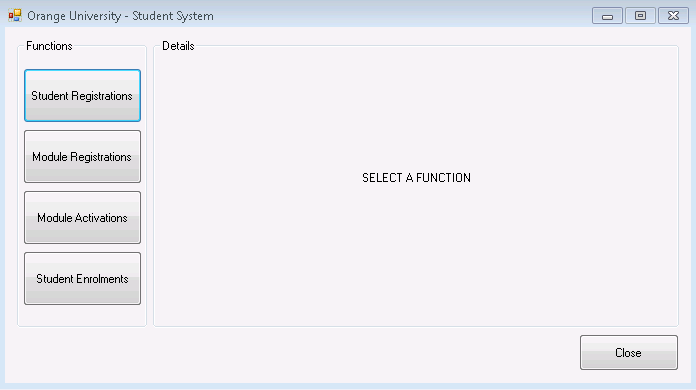
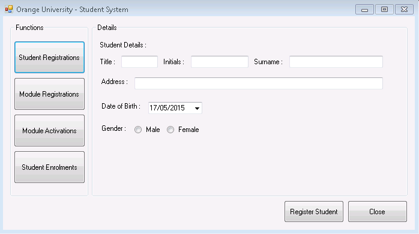
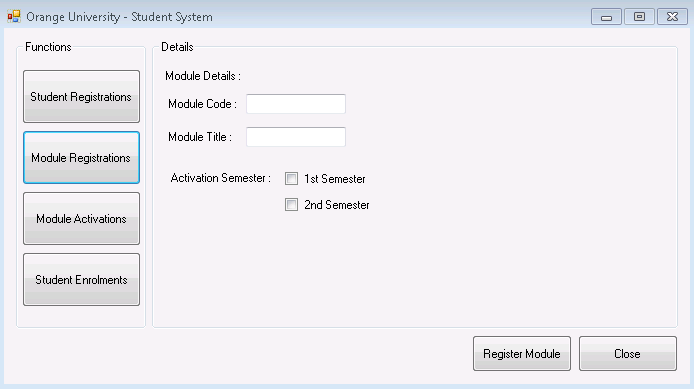
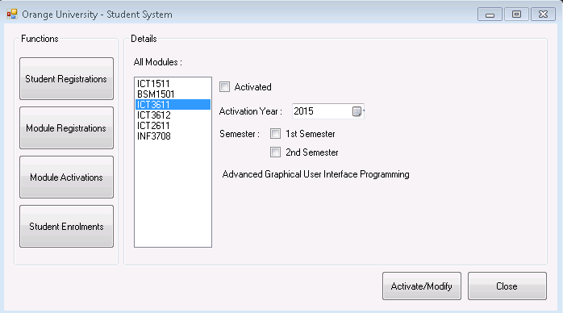
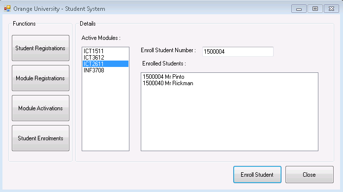

# unisa-ict3611-50121308

UNISA Assignment 1 for 'Advanced' Graphical User Interface Programming Module.
* Student/Module management system
 * Visual Basic
 * Data to Text Files

## Load Screen

## Student Registrations

## Module Registrations

## Module Semester Activations

## Student Enrollments to MOdules

